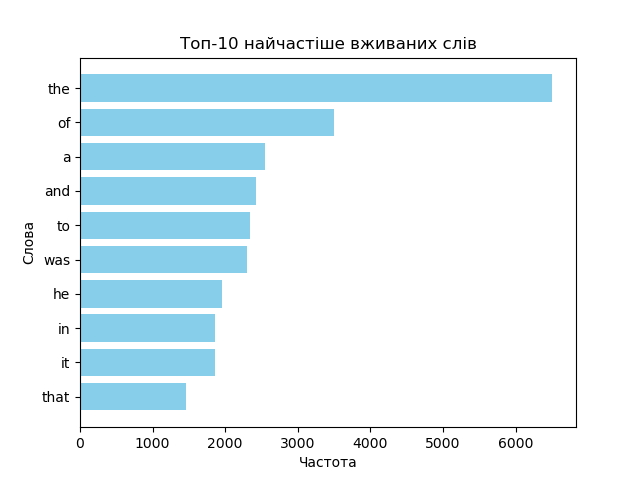

# Homework Assignment for the "Asynchronous Processing" Module | goit-cs-hw-05

Introduction:
In today's world of modern information technology, processing vast amounts of data requires efficient and fast methods. Your task is to write two Python scripts: one applies asynchronous capabilities to sort files into folders, and the other uses the MapReduce paradigm to analyze word frequency in a text and visualize the results.

This homework will help you develop skills in asynchronous programming and effective file processing. By completing this assignment, you will:

- Practice using libraries for asynchronous programming and optimizing performance.
- Implement asynchronous functions for recursive reading and sorting of files.
- Apply Python's parallel processing capabilities to speed up code execution.
  Asynchronous processing is an integral part of real-world projects in programming. The ability to work effectively with asynchronous code is critical for professionals handling large datasets, high workloads, and operations requiring real-time execution.

## **Task Descriptions**

---

## **Task 1**

Write a Python script that reads all files in a user-specified source folder and distributes them into subfolders in the destination folder based on their file extensions. The script must perform sorting asynchronously for efficient processing of large numbers of files.

### **Step-by-Step Instructions**

1. **Import necessary asynchronous libraries.**
2. **Create an `ArgumentParser` object** to handle command-line arguments.
3. Add required arguments to specify the source and destination folders.
4. **Initialize asynchronous paths** for the source and destination folders.
5. Write an **asynchronous function `read_folder`** that recursively reads all files in the source folder and its subfolders.
6. Write an **asynchronous function `copy_file`** that copies each file into the corresponding subfolder in the destination folder based on its extension.
7. Configure **error logging.**
8. Execute the `read_folder` asynchronous function in the main block.

### **Acceptance Criteria**

- Code performs asynchronous reading and copying of files.
- Files are distributed into subfolders based on their extensions.
- The program handles command-line arguments.
- All errors are logged.
- Code is readable and adheres to PEP 8 standards.

---

## **Task 2**

Write a Python script that downloads text from a given URL, analyzes word frequency using the MapReduce paradigm, and visualizes the most frequently used words.

### **Step-by-Step Instructions**

1. **Import necessary modules** (e.g., `matplotlib` and others).
2. **Use the provided MapReduce implementation** from the reference notes.
3. Create a function `visualize_top_words` to visualize the results.
4. In the main code block:
   - Fetch text from the URL.
   - Apply the MapReduce paradigm.
   - Visualize the results.

👉 **For example**, for the top 10 most frequently used words, the graph could look like this:

### **Acceptance Criteria**

- Code fetches text from the given URL.
- Code performs word frequency analysis using MapReduce.
- Visualization displays the top words by frequency.
- Code uses multithreading for parallel processing.
- Code is readable and adheres to PEP 8 standards.
